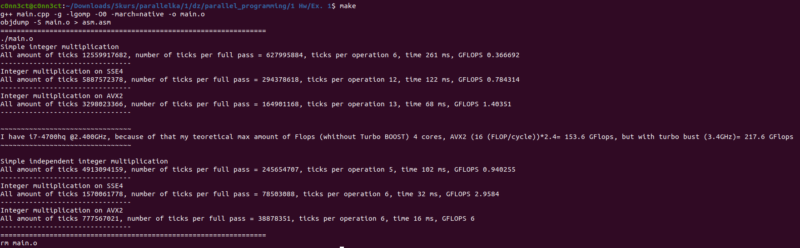

# parallel_programming
Parallel programming 


Для запуска:

```shell
make
```


Пример работы: 



[Пример выполнения в текстовом виде](https://github.com/disc0nn3ct/parallel_programming/blob/main/1%20Hw/Ex.%201/src/result.txt)