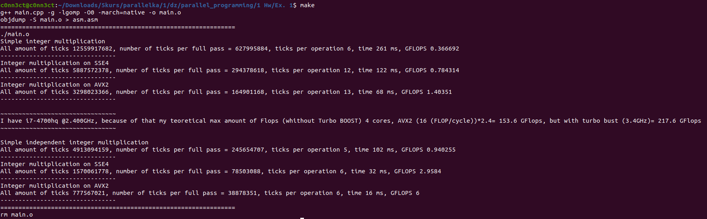

# parallel_programming
Parallel programming 

# Оценка максимальной производительности микропроцессора на заданных операциях

## Вариант 17 

Цель: оценить максимальную производительность микропроцессора на целочисленном умножении, векторном целочисленном умножении.
Постановка задачи:

- Написать программу, выполняющую многократно (в цикле) заданную арифметическую операцию.
- Замерить время выполнения цикла. По результатам замера получить оценку производительности
микропроцессора на заданной операции (в тактах процессора):
а) используя последовательность зависимых операций ("латентность"),
б) используя последовательность независимых операций ("темп выдачи результатов").


Для запуска:

```shell
make
```


Пример работы: 



[Пример выполнения в текстовом виде](https://github.com/disc0nn3ct/parallel_programming/blob/main/1%20Hw/Ex.%201/src/result.txt)