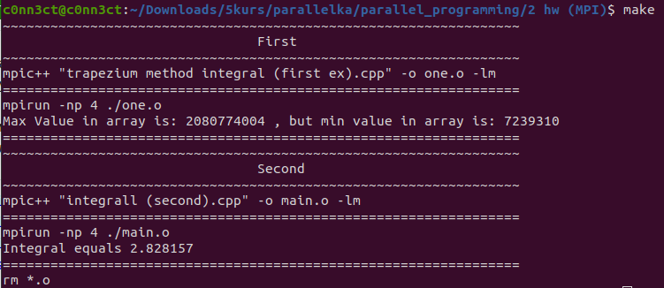

# parallel_programming
Parallel programming 

# MPI

## Вариант 17 

Задание 1: 
Задача поиска максимального и минимального значений для заданного набора числовых данных
Задание 2: 
Интегрование
(Я сделал метод трапеции)


Для запуска:

```shell
make
```


Пример работы 1 и 2 задания: 



[Задание 1]()
[Задание 2]()