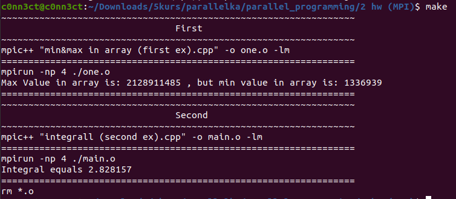

# parallel_programming
Parallel programming 

# MPI

## Вариант 17 

Задание 1: 
Задача поиска максимального и минимального значений для заданного набора числовых данных

Задание 2: 
Интегрование
(Я сделал метод трапеции)


Для запуска:

```shell
make
```


Пример работы 1 и 2 задания: 



[Задание 1](https://github.com/disc0nn3ct/parallel_programming/blob/main/2%20hw%20(MPI)/min%26max%20in%20array%20(first%20ex).cpp)

[Задание 2](https://github.com/disc0nn3ct/parallel_programming/blob/main/2%20hw%20(MPI)/integrall%20(second%20ex).cpp)